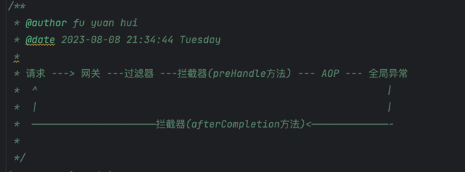

## springboot + logback + MDC 实现日志的全链路追踪

## 0. MDC-server 模块
这是一个mock模块，用来mock各种服务的，feign调用，http调用都会来到这里。

## 1. MDC-core 模块
1. 首先看下 `com.qiuguan.mdc.demo` 包下的2个类，里面演示了MDC的基本用法
2. `com.qiuguan.mdc.controller` 包下是web场景下使用MDC
> 1.`MDCController` ---> `OrderService` ---> `异步发送积分`, 前面2步日志可以正常打印MDC的信息，但是`异步发送积分` 中使用 `new Thread()` 方式无法打印MDC信息，但是通过包装后的线程池在发送就可以正常打印MDC信息了。<br>
> 2.`MdcLogInterceptor` webmvc拦截器的preHandle()方法指定MDC信息

3. 请求进来先到 **过滤器**，再到 **拦截器**，再到**AOP**, 所以trace_id在哪里设置一目了然。（请看`MdcLogInterceptor`类的注释)

> 推荐设置在`过滤器`中,而且过滤器最好是所有模块共用的。但实际上： 我习惯用 {@link org.springframework.web.servlet.HandlerInterceptor} 接口来设置和移除trace_id 在prehandle()方法中设置traceId, 在afterCompletion()方法中移除traceId


## 2. MDC-feign
这个模块我是想演示feign调用的MDC打印<br>
1. 看里面的config目录下的拦截器就明白了。
2. 入口在controller类中


## 3. MCD-http
用来测试 RestTemplate, WebClient, OkHttpClient, HttpClient 发起的请求如何设置trace。

## 4.MDC 存在的问题
1. 子线程打印日志丢失traceId
> 就是我前面提到的`异步发送积分`,通过修改线程池的工具类可以解决。<br>

主要就是`父线程启动子线程先调用MDC.getCopyOfContextMap()方法获取返回值，子线程执行任务前优先调用MDC.setContextMap(context)方法将上面的返回值设置进去`
```java
主线程：
Map<String, String> mainContext = MDC.getCopyOfContextMap()

子线程：
MDC.setContextMap(mainContext)
```

2. feign调用丢失trace_id ? <br>
这个需要再调用方给feign拦截器的header设置trace_id, 然后提供服务方配置一个MVC拦截器，从HttpServletRequest的请求头中获取trace_id, 然后设置到MDC中

3. Http调用丢失traceId
> 这个我没有测试，[参考文档](https://juejin.cn/post/7074461710030995492)
<br>

如果测试就用`MDCHttpController`进行测试吧，因为目前使用这种方法调用的比较少。如果调用外部服务，不设置应该也可以吧